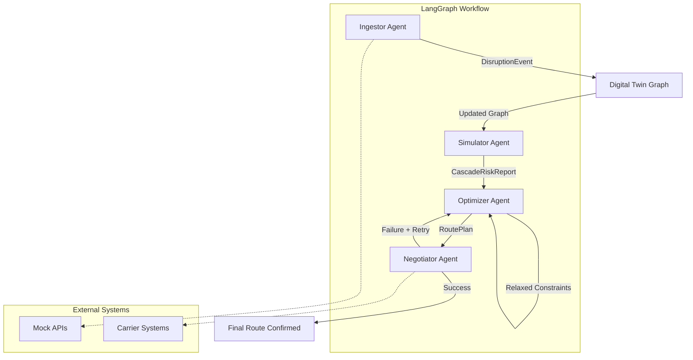

# Real-Time Supply Chain Digital Twin & Disruption Fleet

A multi-agent system that ingests real-time global data, simulates supply chain disruptions using a graph-based Digital Twin, and autonomously re-routes logistics to minimize cost, delay, and carbon footprint.

## Architecture Overview



## Features

- **Real-time Data Ingestion**: Mocks global supply chain events with severity classification
- **Graph-based Digital Twin**: NetworkX representation of supply chain routes (Shanghai → Suez → Rotterdam → Chicago)
- **Monte Carlo Simulation**: 1000+ simulations to predict cascade delays and risks
- **Multi-Objective Optimization**: Google OR-Tools solver balancing time, cost, and carbon footprint
- **Autonomous Negotiation**: Carrier booking with retry logic and constraint relaxation

## Installation

```bash
pip install -r requirements.txt
```

## Usage

Run the complete workflow:

```bash
python main.py
```

Run tests:

```bash
pytest tests/ -v
```

## Project Structure

```
supply_chain_twin/
├── README.md
├── requirements.txt
├── main.py
├── src/
│   ├── __init__.py
│   ├── models.py          # Pydantic models for State, DisruptionEvent, RoutePlan
│   ├── digital_twin.py    # NetworkX graph setup
│   ├── workflow.py        # LangGraph StateGraph definition
│   └── agents/
│       ├── __init__.py
│       ├── ingestor.py    # Mocks API calls, classifies severity
│       ├── simulator.py   # Monte Carlo simulations
│       ├── optimizer.py   # OR-Tools multi-objective solver
│       └── negotiator.py  # Mocks carrier communications
└── tests/
    ├── __init__.py
    ├── test_models.py
    ├── test_simulator.py
    ├── test_optimizer.py
    └── test_workflow.py
```

## Agent Descriptions

### Ingestor Agent
- Mocks external API calls for supply chain events
- Classifies disruption severity (Low/Medium/High/Critical)
- Outputs `DisruptionEvent` with affected nodes

### Simulator Agent
- Removes blocked nodes from the Digital Twin graph
- Runs 1000+ Monte Carlo simulations with random edge weight variance
- Generates `CascadeRiskReport` with predicted delays

### Optimizer Agent
- Uses Google OR-Tools for multi-objective linear programming
- Minimizes weighted score of: time, cost, carbon footprint
- Handles constraint relaxation on retry

### Negotiator Agent
- Attempts to book routes with carriers (mocked)
- Simulates 20% failure rate
- Implements retry logic with relaxed constraints (+15% budget)

## Example Output

```
=== Supply Chain Digital Twin Workflow ===

[INGESTOR] Received event: Suez Canal Blocked
[INGESTOR] Severity: CRITICAL
[INGESTOR] Affected nodes: ['suez_canal']

[SIMULATOR] Running 1000 Monte Carlo simulations...
[SIMULATOR] Cascade risk identified: High delay probability on alternate routes
[SIMULATOR] Recommended action: Re-route via Cape of Good Hope

[OPTIMIZER] Solving multi-objective optimization...
[OPTIMIZER] Found optimal route: shanghai -> cape_of_good_hope -> rotterdam -> chicago
[OPTIMIZER] Estimated time: 28 days, Cost: $45000, Carbon: 890 tons

[NEGOTIATOR] Attempting to book route with carrier...
[NEGOTIATOR] Booking successful!

=== Final Route Confirmed ===
Route: shanghai -> cape_of_good_hope -> rotterdam -> chicago
Total Time: 28 days
Total Cost: $45000
Carbon Footprint: 890 tons
```

## License

MIT License
